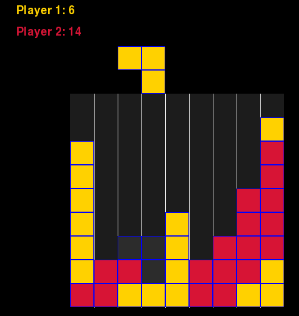

# PyLinkx - Pygame-CE Game with Gymnasium RL Integration

PyLinkx is a two-player block placement game on a 9×9 grid with a full Gymnasium RL environment for training reinforcement learning agents. Players place tetris-like pieces and win by connecting opposite borders (path win) or holding the largest contiguous area when all pieces are used (score win).




## Setup

```bash
python3 -m venv .venv
source .venv/bin/activate
pip install -r requirements.txt
```

## Usage

### Play Interactively

```bash
python src/main.py
```

**Goal:** Connect two opposite borders of the 9×9 grid with your pieces (path win), or hold the largest contiguous area when all pieces are used (score win). Players alternate turns.

**Controls:**

| Key | Action |
|-----|--------|
| `Tab` | Cycle to next piece in queue |
| `←` / `→` | Move piece left / right |
| `↑` | Rotate piece 90° clockwise |
| `Enter` | Flip piece horizontally |
| `↓` | Drop piece (place it, ends your turn) |
| `R` | Restart (game over screen) |
| `Esc` | Quit |

### RL Training

```bash
# Verify environment works
python src/training/train.py --mode test

# Train against drop-first fallback P2 (first loop)
python src/training/train.py --mode train --timesteps 4000000

# Train against a frozen opponent model (iterative self-play)
python src/training/train.py --mode train --timesteps 4000000 --opponent-model models/best_model.zip

# Evaluate a trained model
python src/training/train.py --mode evaluate --model models/best_model.zip --eval-episodes 200 --render
```

**Training options:**
- `--timesteps`: Number of training steps (default: 100000)
- `--envs`: Number of parallel environments (default: CPU cores − 1)
- `--maxsteps`: Max steps per episode (default: 500)
- `--maxstepsbyturn`: Max steps per turn before forced drop (default: 36)
- `--model`: Path to save/load model (default: `models/ppo_pylinkx.zip`)
- `--opponent-model`: Path to opponent model for P2 (default: drop-first fallback)
- `--eval-episodes`: Number of evaluation episodes (default: 100)
- `--render`: Show game visualization during evaluation
- `--game-eval-freq`: How often (in timesteps) to log game metrics to TensorBoard (default: 10000)

### TensorBoard Monitoring

Training automatically logs metrics to TensorBoard. Launch it in a separate terminal while training runs:

```bash
tensorboard --logdir logs
# Open http://localhost:6006
```

Available panels:

| Panel | Metrics |
|-------|---------|
| eval/ | mean_reward, mean_ep_length |
| rollout/ | ep_rew_mean, ep_len_mean |
| train/ | explained_variance, entropy_loss, value_loss, learning_rate, clip_fraction |
| game/ | win_rate, path_win_rate, score_win_rate, loss_rate, mean_p2_drops |

The `game/` metrics come from a mini-evaluation (20 episodes) run every `--game-eval-freq` steps, giving real-time visibility into win rates and strategy distribution.

### Tests

```bash
pytest                          # All tests
pytest tests/test_rl_env.py -v  # RL environment only
pytest --cov=src                # With coverage
```

### Web Build (itch.io)

```bash
python -m pygbag src/main.py
```

Opens a local server at `http://localhost:8000` — verify the game works in browser, then upload the generated `build/web/` folder to itch.io. Set the game kind to **HTML** and iframe dimensions to **600×600**.

## Project Structure

```
.
├── src/
│   ├── main.py                      # Interactive game entry point
│   ├── game/
│   │   ├── game.py                  # Core game logic and RL interface
│   │   ├── player.py                # Player state and piece queue
│   │   ├── piece.py                 # Tetris piece definitions (7 shapes)
│   │   ├── game_renderer.py         # Pygame rendering
│   │   └── menu_renderer.py         # Menu rendering
│   ├── training/
│   │   ├── game_env.py              # Gymnasium environment wrapper
│   │   └── train.py                 # PPO training, evaluation, and test scripts
│   └── pipeline/
│       ├── pipeline.py              # Automated self-play training pipeline
│       ├── evaluate_matrix.py       # Round-robin model evaluation
│       └── manifest.json            # Training history and model registry
├── tests/
│   ├── test_game_*.py               # Game logic tests
│   ├── test_player_*.py             # Player scoring tests
│   └── test_rl_env.py               # Gymnasium environment tests
├── models/                          # Game-ready model checkpoints
├── requirements.txt
└── README.md
```

## RL Environment

### Action Space

`Discrete(6)` — six actions:

| Value | Action | Effect |
|-------|--------|--------|
| 0 | Cycle piece | Switch to next piece in queue |
| 1 | Move left | Move current piece left |
| 2 | Move right | Move current piece right |
| 3 | Rotate | Rotate 90° clockwise |
| 4 | Flip | Flip piece horizontally |
| 5 | Drop | Place piece at ghost position (ends turn) |

### Observation Space

`Dict` with two components:

- **`grid`**: `Box(9, 9, 1)` — game grid normalized to `[0.0, 0.5, 1.0]` (empty / player 1 / player 2)
- **`scalars`**: `Box(258,)` — 258 normalized scalar features:

| Range | Content |
|-------|---------|
| `[0:34]` | Player indicator, piece position, scores, can-drop flag, piece ID, remaining ratio, game-over flag, action validity, turn time left, current piece shape (4×4=16 values), path progress for both players |
| `[34:146]` | P1 piece inventory — 7 piece types × 16 cells; each cell = canonical shape bit × (count/2), so 0 = absent, 0.5 = 1 copy left, 1.0 = 2 copies left |
| `[146:258]` | P2 piece inventory — same encoding |

### Reward Structure

Agent plays as P1 only. P2 is controlled internally by a frozen opponent model or a drop-first fallback.

| Event | Reward |
|-------|--------|
| P1 path win | +100.0 |
| P1 score win | +20.0 |
| P2 path win (P1 loses) | −100.0 |
| P2 score win (P1 loses) | −20.0 |
| Drop (place piece) | +1.0 + path progress bonus |
| Invalid action | −0.1 |
| Cycle piece | −0.05 |
| Other actions | −0.001 |

### Training Configuration (MaskablePPO)

| Hyperparameter | Value |
|---------------|-------|
| Policy | MultiInputPolicy |
| Features extractor | Custom CNN (3×Conv2d → 128-dim) + MLP (258→128-dim) |
| Learning rate | 3e-4 (constant) |
| n_steps | 4096 |
| batch_size | 256 |
| n_epochs | 10 |
| gamma | 0.995 |
| ent_coef | 0.05 |
| Reward normalization | VecNormalize (rewards only) |
| Action masking | sb3-contrib MaskablePPO |

### Iterative Self-Play Training

The agent is trained through an iterative self-play curriculum:

1. **Loop 1**: Train P1 against a "drop-first" fallback P2 (drops immediately when valid, otherwise random valid action)
2. **Loop 2+**: Train a fresh P1 against the best model from the previous loop as P2
3. Each generation learns to beat the previous one, progressively getting stronger

The opponent model is loaded into memory at environment creation — it stays fixed during training even as `best_model.zip` is updated on disk by the EvalCallback.

#### Training Results

| Loop | Timesteps | Opponent | P1 Win % | P1 Path | P1 Score | P2 Path | P2 Score | Mean Reward |
|------|-----------|----------|----------|---------|----------|---------|----------|-------------|
| 1 | 1M | drop-first | — | — | — | — | — | (baseline) |
| 2 | 2M | loop1 model | 72.7% | 37.3% | 35.3% | 9.3% | 18.0% | 43.34 |
| 3 | 2M | loop2 model | 69.5% | 30.5% | 39.0% | 8.5% | 22.0% | 34.05 |
| 4 | 4M | loop3 model | 78.0% | ~51% | ~27% | ~12% | ~10% | 56.78 |
| 5 | 6M | loop4 model | 68.5% | 53.0% | 15.5% | 12.5% | 19.0% | 49.82 |

Key trends:
- Path win rate steadily climbing (37% → 53%), showing the agent increasingly favors the stronger win condition
- Win rate holds 68–78% against progressively stronger opponents — lower % doesn't mean weaker agent
- Score wins declining as path strategy dominates (35% → 15.5%)
- Longer training runs (4M+) produce noticeably better results
- Diminishing returns observed at loop 5 — may indicate a plateau in the current architecture/reward setup

## Roadmap

**Goal**: Add a game menu where the player chooses to play against a human (current mode) or against one of three AI difficulty levels:

| Difficulty | Description |
|------------|-------------|
| Easy | Early-loop model (basic piece placement, minimal strategy) |
| Medium | Mid-loop model (decent area control, some path attempts) |
| Hard | Best available model (strong path-building strategy) |

This requires training many models through the self-play curriculum, evaluating them, and selecting three that provide distinct difficulty levels for a human player. The training pipeline will be automated to version models per loop, evaluate against multiple baselines, and detect when improvement plateaus.

## Dependencies

- **pygame-ce** — game rendering and UI (Community Edition, with WebAssembly support)
- **gymnasium** — RL environment standard
- **numpy** — numerical computing
- **sb3-contrib** — MaskablePPO with action masking
- **stable-baselines3** — PPO base implementation
- **pytest** — testing framework
